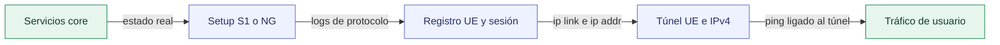

# Lain5G-Lab

<div align="center">

**Orquestación basada en evidencia para redes software 4G/5G y laboratorios X300/X310 protegidos**

[](https://github.com/guallycanazas/Lain5G/actions/workflows/ci.yml)
[](https://github.com/guallycanazas/Lain5G/releases/tag/v1.1.0)
[](LICENSE)
[](docs/installation.md)
[](backend/requirements.txt)

[English README](README.md) · [Documentación](#documentación) · [Evidencia pública](results/public/README.md) · [Citación](#citación)

</div>

Lain5G-Lab es una integración de laboratorio orientada a reproducibilidad sobre
GNU/Linux y Docker Compose. Expone dos perfiles públicos de datos completamente
software, 4G LTE y 5G SA, y dos perfiles RF protegidos para X300/X310. Integra
componentes de red consolidados con aislamiento de escenarios, configuración
declarativa, operación guiada, validadores, registros locales, una API FastAPI,
una interfaz React y controles RF fail-closed.

Lain5G-Lab **no** reimplementa un core móvil, RAN, IMS ni base de datos. La
contribución propia es la integración, orquestación, validación, trazabilidad,
experiencia del operador y capa de seguridad alrededor de Open5GS, UERANSIM,
srsRAN, Kamailio, UHD y software relacionado con licencias independientes.

> **Estado de publicación:** [`v1.1.0`](https://github.com/guallycanazas/Lain5G/tree/v1.1.0)
> es la última release inmutable. Incluye el instalador de máquina limpia, la
> configuración privada generada y la cadena visual de evidencia. Una entrega a
> SoftwareX deberá identificar una release y un archivo/DOI exactos; aquí no se
> afirma un artículo aceptado ni un DOI.

## 1. Instalar Primero

En una máquina GNU/Linux x86_64 limpia, use la ruta soportada:

```bash
git clone https://github.com/guallycanazas/Lain5G.git
cd Lain5G
./install.sh
```

Para revisar el plan completo antes de modificar el equipo:

```bash
./install.sh --dry-run
```

El instalador detecta `apt-get`, `dnf`, `pacman` o `zypper` y prepara el entorno:

| Etapa | Resultado |
| --- | --- |
| Herramientas | Python 3 con `venv`, Node.js, npm, Git, GNU Make y util-linux |
| Contenedores | Docker Engine y Docker Compose v2 instalados y habilitados |
| Acceso | Membresía del grupo Docker configurada cuando sea necesaria |
| Estado privado | Perfiles y configuración local ignorados, con permisos restrictivos |
| Componentes | Todas las imágenes únicas de los cuatro perfiles públicos descargadas |
| RF | Ninguna transmisión; la operación de hardware sigue separada, autorizada y bloqueada por defecto |

Si aparece `PASO REQUERIDO`, active el grupo Docker:

```bash
newgrp docker
```

Los requisitos detallados y la alternativa manual están en
[docs/installation.md](docs/installation.md).

## 2. Probar una Red Software

La comprobación extremo a extremo más corta usa LTE completamente software:

```bash
./lain5g scenario start 4g-lte-sim
./lain5g scenario validate 4g-lte-sim
./lain5g scenario stop 4g-lte-sim
```

El validador espera el attach y revisa EPC, S1, registro UE, bearer por defecto,
`tun_srsue`, dirección IPv4 y ping enlazado explícitamente al túnel UE. Un
`WARNING` nunca se transforma en `PASS`.

La ruta equivalente para 5G SA software es:

```bash
./lain5g scenario start 5g-sa
./lain5g scenario validate 5g-sa
./lain5g scenario stop 5g-sa
```

### Interfaz visual

En una estación de laboratorio dedicada y confiable:

```bash
./lain5g app start --operations --open
```

Abra **Scenarios**, elija un perfil y pulse **Run evidence check**. El overview
muestra una cadena explícita de evidencia y enlaza el run y los logs sanitizados.
Detenga la interfaz con `./lain5g app stop`.

`--operations` concede al backend acceso al socket Docker y al árbol del
proyecto. Úselo solo en un host confiable. La interfaz de solo observación se
inicia con `./lain5g app start --open`; la consola interactiva es `./lain5g`.

## 3. Evidencia, no solo Contenedores Verdes



Una etapa solo es `PASS` cuando todos sus checks requeridos tienen evidencia.
Un contenedor activo no demuestra registro UE, IP, tráfico, emisión RF ni
recepción por aire. En X310 se separan detección UHD, preflight, core, proceso
eNB/gNB con tiempo limitado, S1/NG y evidencia de UE externo. Sin prueba por
aire, esa etapa permanece `NOT_TESTED`.

<a id="canonical-capability-status"></a>

## 4. Perfiles Públicos

| Perfil | Modo | Alcance integrado | Límite de evidencia |
| --- | --- | --- | --- |
| `4g-lte-sim` | Solo software | EPC Open5GS + srsENB/srsUE por ZMQ | Resumen histórico sanitizado: [14/14 `PASS`](results/public/4g-lte-sim/run-20260723-055025.json) |
| `5g-sa` | Solo software | 5GC Open5GS + gNB/UE UERANSIM + PDU de datos | Resumen histórico sanitizado: [15/15 `PASS`](results/public/5g-sa-sim/run-20260723-054913.json) |
| `4g-lte-x310` | RF protegido | EPC Open5GS + IMS compacto + eNB srsRAN + X300/X310 compatible | Flujo protegido y evidencia local; sin resultado RF extremo a extremo público |
| `5g-sa-x310` | RF protegido | 5GC Open5GS + IMS compacto + gNB srsRAN Project + X300/X310 compatible | Flujo protegido y evidencia local; sin resultado RF extremo a extremo público |

Los resultados software públicos son resúmenes históricos sanitizados, no
trazas de protocolo. El snapshot fuente pre-release registrado no está presente
en el historial Git público actual, por lo que no se presenta como una ejecución
reciente de `main`. Otros registros históricos, incluido el intento VoNR público
bloqueado, permanecen en [`results/public/`](results/public/README.md).

Los resultados software no deben extrapolarse a SDR, UE comerciales, medios de
voz ni rendimiento RF. La operación RF exige autorización legal, entorno aislado
o cableado, atenuación, perfil revisado, frase exacta, duración finita y parada
de emergencia accesible.

## 5. Arquitectura


| Área | Responsabilidad |
| --- | --- |
| [`backend/`](backend/) | API local, allowlists de comandos, validación y runs |
| [`frontend/`](frontend/) | Interfaz React y visualización de evidencia |
| [`deployments/`](deployments/) | Compose, configuración de red y scripts protegidos |
| [`config/profiles/`](config/profiles/) | Entradas declarativas software y RF |
| [`results/public/`](results/public/README.md) | Resúmenes históricos revisados, sanitizados y validados por esquema |
| `runs/` | Registros operacionales locales ignorados que pueden ser sensibles |

## 6. Ruta para Revisores de SoftwareX

Después del instalador, ejecute el gate seguro del repositorio:

```bash
make softwarex-check
```

El gate actual aprueba **323 pruebas backend**, **51 pruebas frontend** y **78%
de cobertura backend**, además de TypeScript, build de producción, render seguro
de Compose, perfiles, versión y metadatos de citación, enlaces internos,
resultados públicos, artefactos de release y archivos sensibles.

GitHub Actions ejecuta el mismo comando en Ubuntu 24.04 con Python 3.12 y Node.js
22. Este gate no inicia escenarios celulares, accede a SDR, transmite RF ni
reproduce experimentos históricos; la evidencia operacional se genera con los
validadores de escenario.

### Resumen de metadatos de entrega

| Elemento | Valor del repositorio |
| --- | --- |
| Release inmutable | [`v1.1.0`](https://github.com/guallycanazas/Lain5G/releases/tag/v1.1.0) |
| Control de versiones | Git y GitHub |
| Licencia de código propio | [MIT](LICENSE), con términos upstream separados |
| Lenguajes | Python, TypeScript y Shell |
| Runtime | GNU/Linux x86_64, Docker Engine y Docker Compose v2 |
| Citación | [`CITATION.cff`](CITATION.cff) y [`codemeta.json`](codemeta.json) |
| Reproducibilidad | Matriz de versiones, esquemas, SBOM parcial y CI |
| Soporte | GitHub Issues best-effort y reporte privado de vulnerabilidades |

Antes de una entrega editorial, los autores del artículo deben archivar una
release exacta, añadir su DOI/enlace permanente y aprobar autoría, ORCIDs,
contacto correspondiente, roles CRediT, financiamiento, conflictos y
declaraciones de disponibilidad. Estos valores no se inventan ni se infieren.

## 7. Reproducibilidad y Seguridad

- Las selecciones upstream están en la
  [matriz de versiones](docs/reproducibility/version-matrix.md).
- Los inputs mutables conocidos están en la
  [política de dependencias](docs/reproducibility/dependency-policy.md).
- El CycloneDX incluido es un [SBOM parcial](docs/release/sbom-status.md), no un
  SBOM completo de contenedores o sistema operativo.
- Credenciales, estado RF y notas del operador se mantienen en archivos locales
  ignorados y con permisos restrictivos.
- Los resultados públicos están sanitizados y validados por esquema; los logs
  privados requieren revisión antes de publicarse.
- Los controles RF son fail-closed y CI nunca ejecuta RF.

## Documentación

- [Instalación](docs/installation.md)
- [Simulación 4G](docs/4g_simulation.md)
- [Simulación 5G SA](docs/5g_sa.md)
- [Configuración](docs/configuration.md)
- [Arquitectura](docs/architecture.md)
- [Validación y semántica de evidencia](docs/validation.md)
- [Resultados públicos](results/public/README.md)
- [Seguridad RF](docs/rf_safety.md)
- [Despliegue local seguro](docs/security/local-deployment.md)
- [Solución de problemas](docs/troubleshooting.md)
- [Changelog](CHANGELOG.md)

## Limitaciones

- Es un entorno de investigación y educación, no una red de producción,
  implementación de referencia 3GPP ni plataforma de conformidad.
- Los artefactos públicos son resúmenes sanitizados, no trazas o capturas de
  protocolo independientemente revisables.
- No existe artefacto público que valide X310, RF, interoperabilidad con UE
  comerciales, llamadas completas, audio o RTP.
- Las imágenes del catálogo son inputs pull-only; no se afirma autorización de
  republicación binaria ni atestación fuente.
- Algunos repositorios de paquetes/build no son snapshots y su cierre exacto
  puede depender del tiempo.

## Autores

- **Willian Roy Canazas Rosas**
- **Manuel Ismael Prieto Tito**

Afiliación de la release: **Universidad Nacional de San Agustín de Arequipa**.
La autoría del artículo requiere aprobación independiente; consulte
[`AUTHORS.md`](AUTHORS.md).

## Citación

Los metadatos están en [`CITATION.cff`](CITATION.cff). El DOI del software y la
cita SoftwareX se añadirán después de un archivo/publicación real. Actualmente
no se afirma un DOI ni un artículo aceptado.

## Licencia

El código propio se distribuye bajo [MIT](LICENSE). El software upstream,
configuraciones importadas, bases de datos e imágenes conservan sus licencias y
términos. Consulte [`THIRD_PARTY_NOTICES.md`](THIRD_PARTY_NOTICES.md) y el
[estado de redistribución](docs/legal/redistribution-status.md).

## Soporte y Seguridad

Use [GitHub Issues](https://github.com/guallycanazas/Lain5G/issues) para errores
reproducibles no sensibles. No publique secretos, identificadores, direcciones
privadas, planes RF, tokens, autorizaciones ni logs privados. Use el reporte
privado de vulnerabilidades para seguridad y revise [`SUPPORT.md`](SUPPORT.md).
