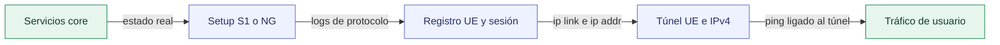
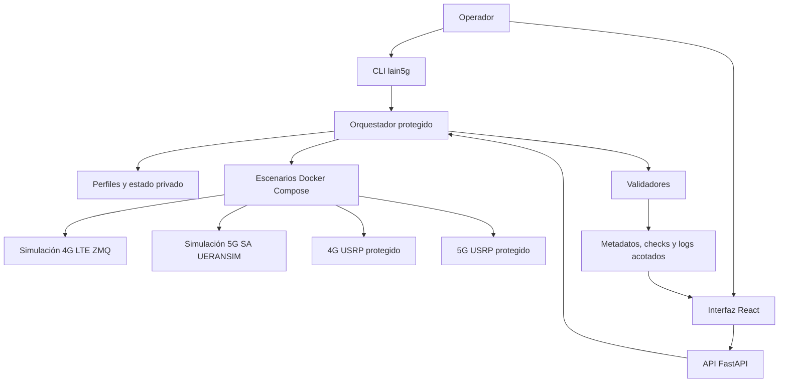

# OpenLain5G

<div align="center">

**Orquestación basada en evidencia para redes software 4G/5G y laboratorios USRP X-Series protegidos**

[](https://github.com/guallycanazas/Lain5G/actions/workflows/ci.yml)
[](https://github.com/guallycanazas/Lain5G/releases/tag/v1.1.5)
[](LICENSE.txt)
[](docs/installation.md)
[](src/backend/requirements.txt)

[English README](README.md) · [Documentación](#documentación) · [Evidencia pública](results/public/README.md) · [Citación](#citación)

</div>

OpenLain5G es un framework modular para laboratorios reproducibles de redes
móviles 4G LTE y 5G SA. Despliega y administra componentes open source de RAN,
core, IMS y simulación mediante Docker Compose, una interfaz de línea de comandos
y una aplicación web. Está diseñado para investigación, pruebas y educación, y
ofrece un entorno personalizable con escenarios completamente software, flujos
USRP X-Series protegidos, configuración declarativa, validación automatizada y
evidencia trazable de cada ejecución.

> **Estado de publicación:** [`v1.1.5`](https://github.com/guallycanazas/Lain5G/tree/v1.1.5)
> es la última release inmutable.

> **Nombres:** OpenLain5G es el nombre actual del proyecto. La URL del
> repositorio, la CLI `lain5g`, las variables `LAIN5G_*`, los IDs de perfiles y
> los nombres de imágenes se conservan por compatibilidad.

## 1. Instalar Primero

En un equipo GNU/Linux x86_64, obtenga primero el código fuente. El comando
siguiente requiere Git; si todavía no está instalado, también puede descargar
un archivo del repositorio:

```bash
git clone https://github.com/guallycanazas/Lain5G.git
cd Lain5G
./install.sh
```

Para revisar el plan completo antes de modificar el equipo:

```bash
./install.sh --dry-run
```

El instalador prepara automáticamente sistemas con `apt-get`, `dnf`, `pacman` o
`zypper`. Otras distribuciones, Docker rootless, equipos administrados y sistemas
de inicio no estándar deben satisfacer los requisitos documentados manualmente.

| Etapa | Resultado |
| --- | --- |
| Herramientas | Python 3 con `venv`, Node.js, npm, Git, GNU Make y util-linux |
| Contenedores | Docker Engine y Docker Compose v2 instalados; el daemon se inicia cuando el sistema lo permite |
| Acceso | Membresía del grupo Docker configurada solo si el equipo usa ese modelo |
| Estado privado | Perfiles y configuración local ignorados, con permisos restrictivos |
| Componentes | Todas las imágenes únicas de los cuatro perfiles públicos descargadas |
| RF | Ninguna transmisión; la operación de hardware sigue separada, autorizada y bloqueada por defecto |

Si la instalación cambió la membresía del grupo Docker y la sesión actual aún no
tiene acceso, vuelva a iniciar sesión o abra un shell con el grupo actualizado:

```bash
newgrp docker
```

Los requisitos detallados y la alternativa manual están en
[docs/installation.md](docs/installation.md).

## 2. Operar OpenLain5G

Después de la instalación, elija una de las dos interfaces de operación.

### Opción 1: Aplicación web

En una estación de laboratorio dedicada y confiable, inicie la aplicación web:

```bash
./lain5g app start --operations --open
```

Abra **Scenarios**, elija un perfil y pulse **Run evidence check**. El overview
muestra una cadena explícita de evidencia y enlaza la ejecución y los logs
sanitizados. Detenga la aplicación con `./lain5g app stop`.

`--operations` concede al backend acceso al socket Docker y al árbol del
proyecto. Úselo solo en un host confiable. Para acceso de solo observación,
ejecute `./lain5g app start --open`.

### Opción 2: CLI interactiva

Inicie la interfaz guiada de terminal con:

```bash
./lain5g
```

Use sus menús para preparar el equipo, administrar componentes, elegir un perfil
y configurar, iniciar, inspeccionar, validar o detener una red software. Los
perfiles RF conservan sus controles de autorización, preflight, duración finita
y parada de emergencia. Los comandos de automatización directa permanecen en
[Instalación](docs/installation.md) y en las guías de cada escenario.

## 3. Evidencia, no solo Contenedores Verdes



Una etapa solo es `PASS` cuando todos sus checks requeridos tienen evidencia.
Un contenedor activo no demuestra registro UE, IP, tráfico, emisión RF ni
recepción por aire. En perfiles USRP protegidos se separan detección UHD,
preflight, core, proceso eNB/gNB con tiempo limitado, S1/NG y evidencia de UE
externo. Sin prueba por aire, esa etapa permanece `NOT_TESTED`.

<a id="canonical-capability-status"></a>

## 4. Perfiles Públicos

| Perfil | Modo | Alcance integrado | Límite de evidencia |
| --- | --- | --- | --- |
| `4g-lte-sim` | Solo software | EPC Open5GS + srsENB/srsUE por ZMQ | Resumen sanitizado en VM limpia: [14/14 `PASS`](results/public/4g-lte-sim/run-20260730-021702.json) |
| `5g-sa` | Solo software | 5GC Open5GS + gNB/UE UERANSIM + PDU de datos | Resumen sanitizado en VM limpia: [15/15 `PASS`](results/public/5g-sa-sim/run-20260730-021914.json) |
| `4g-lte-x310` | RF protegido | EPC Open5GS + IMS compacto + eNB srsRAN + USRP X-Series compatible | Flujo protegido con evidencia RF local correlacionada por ejecución |
| `5g-sa-x310` | RF protegido | 5GC Open5GS + IMS compacto + gNB srsRAN Project + USRP X-Series compatible | Flujo protegido con evidencia RF local correlacionada por ejecución |

Los resultados LTE y 5G SA actuales son resúmenes sanitizados de una VM Ubuntu
24.04 limpia, no trazas de protocolo, e identifican
[`59471947`](https://github.com/guallycanazas/Lain5G/commit/59471947da95783c1a85a4d18284360e4b6d898b)
como el commit fuente ejecutado. Los registros históricos de señalización VoLTE
y VoNR, junto con snapshots anteriores, permanecen en
[`results/public/`](results/public/README.md).

Los resultados con SDR, UE comerciales, medios de voz y RF utilizan alcances de
evidencia específicos correlacionados con cada ejecución autorizada. La operación
RF exige autorización legal, entorno aislado o cableado, atenuación, perfil
revisado, frase exacta, duración finita y parada de emergencia accesible.

## 5. Arquitectura



| Área | Responsabilidad |
| --- | --- |
| [`src/backend/`](src/backend/) | API local, allowlists de comandos, validación y runs |
| [`src/frontend/`](src/frontend/) | Interfaz React y visualización de evidencia |
| [`deployments/`](deployments/) | Compose, configuración de red y scripts protegidos |
| [`config/profiles/`](config/profiles/) | Entradas declarativas software y RF |
| [`results/public/`](results/public/README.md) | Resúmenes revisados, sanitizados y validados por esquema |
| `runs/` | Registros operacionales locales ignorados que pueden ser sensibles |

## 6. Verificación del Repositorio

Después del instalador, ejecute el gate seguro del repositorio:

```bash
make softwarex-check
```

El gate actual aprueba **323 pruebas backend**, **51 pruebas frontend** y **78%
de cobertura backend**, además de TypeScript, build de producción, render seguro
de Compose, perfiles, versión y metadatos de citación, enlaces internos,
resultados públicos, artefactos de release y archivos sensibles.

GitHub Actions ejecuta el mismo comando en Ubuntu 24.04 con Python 3.12 y Node.js
22. Este gate no inicia escenarios celulares, accede a SDR, transmite RF ni
reproduce experimentos históricos; la evidencia operacional se genera con los
validadores de escenario.

### Metadatos de la release

| Elemento | Valor del repositorio |
| --- | --- |
| Release inmutable | [`v1.1.5`](https://github.com/guallycanazas/Lain5G/releases/tag/v1.1.5) |
| Control de versiones | Git y GitHub |
| Licencia de código propio | [MIT](LICENSE.txt), con términos upstream separados |
| Lenguajes | Python, TypeScript y Shell |
| Runtime | GNU/Linux x86_64, Docker Engine y Docker Compose v2 |
| Citación | [`CITATION.cff`](CITATION.cff) y [`codemeta.json`](codemeta.json) |
| Reproducibilidad | Matriz de versiones, esquemas, SBOM parcial y CI |
| Soporte | GitHub Issues best-effort y reporte privado de vulnerabilidades |

## 7. Reproducibilidad y Seguridad

- Las selecciones upstream están en la
  [matriz de versiones](docs/reproducibility/version-matrix.md).
- Los inputs mutables conocidos están en la
  [política de dependencias](docs/reproducibility/dependency-policy.md).
- El CycloneDX incluido es un [SBOM parcial](docs/release/sbom-status.md), no un
  SBOM completo de contenedores o sistema operativo.
- Credenciales, estado RF y notas del operador se mantienen en archivos locales
  ignorados y con permisos restrictivos.
- Los resultados públicos están sanitizados y validados por esquema; los logs
  privados requieren revisión antes de publicarse.
- Los controles RF son fail-closed y CI nunca ejecuta RF.

## Documentación

- [Índice de documentación](docs/README.md)
- [Instalación](docs/installation.md)
- [Simulación 4G](docs/4g_simulation.md)
- [Simulación 5G SA](docs/5g_sa.md)
- [Configuración](docs/configuration.md)
- [Arquitectura](docs/architecture.md)
- [Validación y semántica de evidencia](docs/validation.md)
- [Resultados públicos](results/public/README.md)
- [Seguridad RF](docs/rf_safety.md)
- [Despliegue local seguro](docs/security/local-deployment.md)
- [Solución de problemas](docs/troubleshooting.md)
- [Changelog](CHANGELOG.md)

## Autores

- **Willian Roy Canazas Rosas**
- **Manuel Ismael Prieto Tito**
- **Alberth Ronal Tamo Calla**

Afiliación de todos los autores: **Universidad Nacional de San Agustín de Arequipa**.
Consulte [`AUTHORS.md`](AUTHORS.md).

## Citación

Los metadatos de citación están en [`CITATION.cff`](CITATION.cff) y
[`codemeta.json`](codemeta.json).

## Licencia

El código propio se distribuye bajo [MIT](LICENSE.txt). El software upstream,
configuraciones importadas, bases de datos e imágenes conservan sus licencias y
términos. Consulte [`THIRD_PARTY_NOTICES.md`](THIRD_PARTY_NOTICES.md) y el
[estado de redistribución](docs/legal/redistribution-status.md).

## Soporte y Seguridad

Use [GitHub Issues](https://github.com/guallycanazas/Lain5G/issues) para errores
reproducibles no sensibles. No publique secretos, identificadores, direcciones
privadas, planes RF, tokens, autorizaciones ni logs privados. Use el reporte
privado de vulnerabilidades para seguridad y revise [`SUPPORT.md`](SUPPORT.md).
