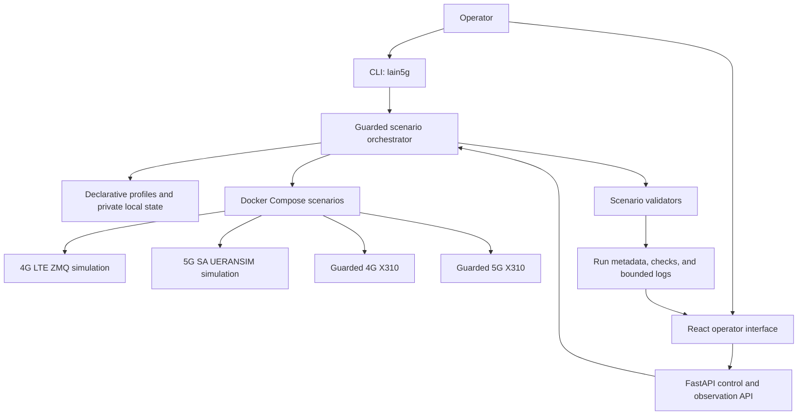

# OpenLain5G

<div align="center">

**Evidence-oriented orchestration for software 4G/5G networks and guarded X300/X310 laboratory workflows**

[](https://github.com/guallycanazas/Lain5G/actions/workflows/ci.yml)
[](https://github.com/guallycanazas/Lain5G/releases/tag/v1.1.0)
[](LICENSE)
[](docs/installation.md)
[](backend/requirements.txt)

[Spanish version](README.es.md) · [Documentation](#documentation) · [Public evidence](results/public/README.md) · [Citation](#citation)

</div>

OpenLain5G is a reproducibility-oriented GNU/Linux and Docker Compose laboratory
integration for two public software data-network profiles, 4G LTE and 5G SA,
and two guarded X300/X310 RF profiles. It combines established upstream mobile
network components with scenario isolation, declarative configuration, guided
operation, validators, local run records, a FastAPI backend, a React interface,
and fail-closed RF safety controls.

OpenLain5G does **not** reimplement a mobile core, RAN, IMS, or database. The
project-authored contribution is the integration, orchestration, validation,
traceability, operator workflow, and safety layer around Open5GS, UERANSIM,
srsRAN, Kamailio, UHD, and related independently licensed software.

> **Release status:** [`v1.1.0`](https://github.com/guallycanazas/Lain5G/tree/v1.1.0)
> is the latest immutable source release. It includes the clean-machine installer,
> generated private setup, and visual proof chain. A SoftwareX submission archive
> and DOI must identify one exact release; this repository does not claim an
> accepted article or DOI.

## 1. Install First

The supported entry point on a clean GNU/Linux x86_64 machine is:

```bash
git clone https://github.com/guallycanazas/Lain5G.git
cd Lain5G
./install.sh
```

Before changing the machine, the complete plan can be inspected with:

```bash
./install.sh --dry-run
```

The installer detects `apt-get`, `dnf`, `pacman`, or `zypper` and prepares the
complete local environment:

| Installer step | Result |
| --- | --- |
| Development tools | Python 3 with `venv`, Node.js, npm, Git, GNU Make, and util-linux |
| Container runtime | Docker Engine and Docker Compose v2 installed and enabled |
| User access | Docker group membership configured when required |
| Private state | Ignored profile and application files created with restrictive permissions |
| Components | All unique images required by the four public profiles downloaded |
| RF behavior | No RF transmission; hardware operation remains separately authorized and fail-closed |

If the installer prints `PASO REQUERIDO`, activate the Docker group before
continuing:

```bash
newgrp docker
```

Detailed prerequisites and the manual alternative are in
[docs/installation.md](docs/installation.md).

## 2. Prove a Software Network

The shortest end-to-end check uses the software-only LTE profile:

```bash
./lain5g scenario start 4g-lte-sim
./lain5g scenario validate 4g-lte-sim
./lain5g scenario stop 4g-lte-sim
```

The validator waits for attachment and checks the EPC, S1 setup, UE
registration, default bearer, `tun_srsue`, assigned IPv4 address, and a ping
explicitly bound to the UE tunnel. A warning is not converted into a pass.

The equivalent software-only 5G SA flow is:

```bash
./lain5g scenario start 5g-sa
./lain5g scenario validate 5g-sa
./lain5g scenario stop 5g-sa
```

### Visual operator interface

On a dedicated, trusted laboratory workstation, launch the operational UI:

```bash
./lain5g app start --operations --open
```

Open **Scenarios**, choose a profile, and select **Run evidence check**. The
overview displays an explicit proof chain and links to the associated run and
sanitized live logs. Stop the UI with:

```bash
./lain5g app stop
```

`--operations` grants the backend access to the Docker socket and project tree;
use it only on a trusted host. The observation-only UI is available with
`./lain5g app start --open`. The terminal-first interface is `./lain5g`.

## 3. Evidence, Not Green Containers


Each stage becomes `PASS` only when all required checks report evidence. A
running container never proves UE registration, an assigned address, user-plane
traffic, RF emission, or over-air reception. For X310 profiles, the visual chain
separates hardware/UHD detection, RF preflight, core readiness, the time-limited
eNB/gNB process, S1/NG evidence, and external UE evidence. Missing over-air UE
evidence remains `NOT_TESTED`.

<a id="canonical-capability-status"></a>

## 4. Public Profiles

| Profile | Mode | Integrated scope | Evidence boundary |
| --- | --- | --- | --- |
| `4g-lte-sim` | Software only | Open5GS EPC + srsENB/srsUE over ZMQ | Clean-VM sanitized summary: [14/14 `PASS`](results/public/4g-lte-sim/run-20260730-021702.json) |
| `5g-sa` | Software only | Open5GS 5GC + UERANSIM gNB/UE + data PDU session | Clean-VM sanitized summary: [15/15 `PASS`](results/public/5g-sa-sim/run-20260730-021914.json) |
| `4g-lte-x310` | Guarded RF | Open5GS EPC + compact IMS infrastructure + srsRAN eNB + compatible X300/X310 | Guarded workflow and local run evidence; no public end-to-end RF result |
| `5g-sa-x310` | Guarded RF | Open5GS 5GC + compact IMS infrastructure + srsRAN Project gNB + compatible X300/X310 | Guarded workflow and local run evidence; no public end-to-end RF result |

The current LTE and 5G SA summaries are sanitized validator records from a clean
Ubuntu 24.04 virtual machine, not raw protocol traces. They identify the exact
`1.1.0` source commit executed. Historical signaling records, including the
blocked public VoNR attempt and older pre-release snapshots, remain under
[`results/public/`](results/public/README.md).

Software results must not be extrapolated to SDR hardware, commercial UEs, voice
media, or RF performance. RF operation requires legal authorization, an isolated
or cabled environment, attenuation, a reviewed profile, an exact confirmation
phrase, a finite duration, and accessible emergency stop.

## 5. Architecture



| Project area | Responsibility |
| --- | --- |
| [`backend/`](backend/) | Local FastAPI API, command allowlists, validation and run services |
| [`frontend/`](frontend/) | React operator interface and evidence visualization |
| [`deployments/`](deployments/) | Isolated Compose models, network configuration, and guarded scripts |
| [`config/profiles/`](config/profiles/) | Declarative software and RF profile inputs |
| [`results/public/`](results/public/README.md) | Reviewed, schema-validated, sanitized summaries |
| `runs/` | Ignored local operational records that may contain sensitive information |

## 6. SoftwareX Reviewer Route

After running the installer, execute the repository-wide safe gate:

```bash
make softwarex-check
```

The current gate passes **323 backend tests**, **51 frontend tests**, and **78%
backend line coverage**, followed by TypeScript checking, a production frontend
build, safe Compose rendering, profile validation, version and citation metadata
checks, internal-link validation, public-result schema checks, release-artifact
checks, and sensitive-file controls.

GitHub Actions runs the same command on Ubuntu 24.04 with Python 3.12 and Node.js
22. This gate does not start telecom scenarios, access SDR hardware, transmit RF,
or reproduce historical network experiments. Operational evidence is generated
separately by the scenario validators.

### Submission metadata snapshot

| SoftwareX item | Repository value |
| --- | --- |
| Current immutable release | [`v1.1.0`](https://github.com/guallycanazas/Lain5G/releases/tag/v1.1.0) |
| Version control | Git and GitHub |
| Project-source license | [MIT](LICENSE), with separate upstream terms |
| Languages | Python, TypeScript, and Shell |
| Runtime | GNU/Linux x86_64, Docker Engine, Docker Compose v2 |
| Citation metadata | [`CITATION.cff`](CITATION.cff) and [`codemeta.json`](codemeta.json) |
| Reproducibility records | Version matrix, public-result schemas, partial SBOM, and CI |
| Support | Best-effort GitHub Issues; private vulnerability reporting for sensitive security reports |

Before journal submission, the article authors must archive one exact release,
add its DOI/permanent archive link, and approve article-specific authorship,
ORCIDs, corresponding-author contact, CRediT roles, funding, conflicts, and data
availability statements. These values are intentionally not inferred here.

## 7. Reproducibility and Security

- Upstream source selections and image inputs are recorded in the
  [version matrix](docs/reproducibility/version-matrix.md).
- Dependency policy and known mutable inputs are documented in
  [dependency policy](docs/reproducibility/dependency-policy.md).
- The included CycloneDX file is a
  [partial application-manifest SBOM](docs/release/sbom-status.md), not a complete
  container or operating-system SBOM.
- Generated subscriber credentials and RF/operator state remain in ignored local
  files with restrictive permissions.
- Public records are schema-validated and sanitized; private run logs must be
  reviewed before any publication.
- RF controls are fail-closed and excluded from automated CI execution.

## Documentation

- [Installation](docs/installation.md)
- [4G software simulation](docs/4g_simulation.md)
- [5G SA software simulation](docs/5g_sa.md)
- [Configuration](docs/configuration.md)
- [Architecture](docs/architecture.md)
- [Validation and evidence semantics](docs/validation.md)
- [Public results](results/public/README.md)
- [RF safety](docs/rf_safety.md)
- [Secure local deployment](docs/security/local-deployment.md)
- [Troubleshooting](docs/troubleshooting.md)
- [Changelog](CHANGELOG.md)

## Limitations

- This is a research and education environment, not a production network, a
  3GPP reference implementation, or a conformance platform.
- Public artifacts are sanitized summaries, not independently reviewable raw
  protocol traces or packet captures.
- No public artifact validates X310 execution, RF behavior, commercial UE
  interoperability, complete voice calls, audio quality, or RTP performance.
- Existing catalog images are pull-only inputs and are not asserted to be
  approved for binary republication or accompanied by source attestations.
- Package-manager and some image-build inputs are not snapshot repositories;
  exact dependency closure can remain time-dependent.

## Authors

- **Willian Roy Canazas Rosas**
- **Manuel Ismael Prieto Tito**

Software-release affiliation: **National University of San Agustin of
Arequipa**. Article authorship and order require separate approval; see
[`AUTHORS.md`](AUTHORS.md).

## Citation

Citation metadata is available in [`CITATION.cff`](CITATION.cff). A software DOI
and SoftwareX article citation will be added only after archival publication. No
DOI or accepted SoftwareX article is currently claimed.

## License

Project-authored source is licensed under the [MIT License](LICENSE). Upstream
software, imported configuration, databases, and container images retain their
own licenses and redistribution terms. See
[`THIRD_PARTY_NOTICES.md`](THIRD_PARTY_NOTICES.md) and the
[redistribution status](docs/legal/redistribution-status.md).

## Support and Security

Use [GitHub Issues](https://github.com/guallycanazas/Lain5G/issues) for
reproducible, non-sensitive bugs. Do not publish secrets, subscriber identifiers,
private addresses, RF plans, tokens, authorization records, or private logs. Use
GitHub Private Vulnerability Reporting for sensitive security reports and read
[`SUPPORT.md`](SUPPORT.md) before sharing diagnostics.
